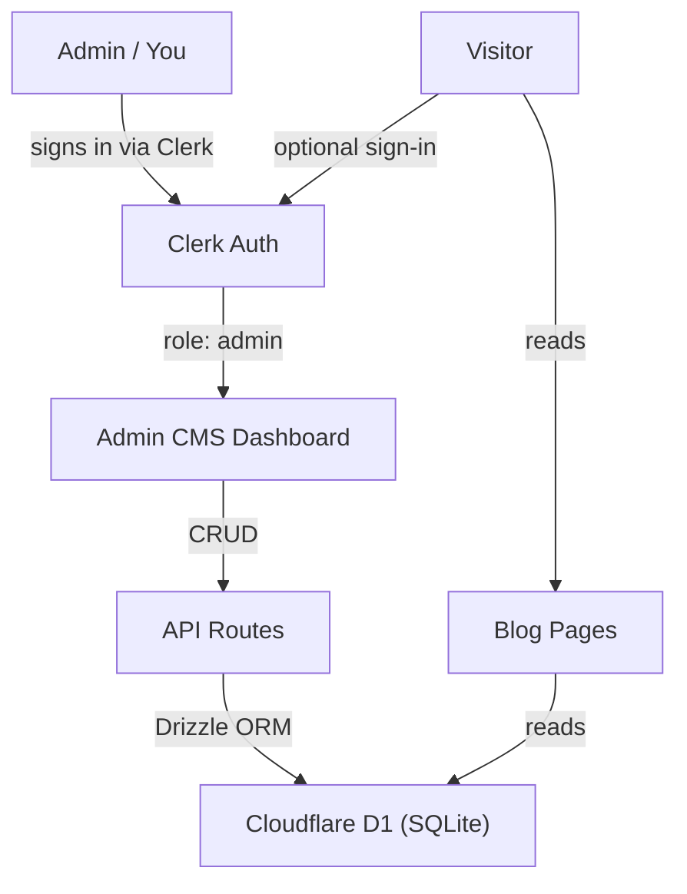

# Blog CMS with Clerk Auth and Cloudflare D1

## Current State

The portfolio at `/Users/harshsolanki/Developer/tokenoverflow` is a React Router 7 app deployed on Cloudflare Workers. Blog posts are currently static markdown files in `app/content/blog/` loaded via `import.meta.glob` in `[app/data/blog.ts](app/data/blog.ts)`. Publishing a new post requires a code commit and deploy.

## Architecture




## 1. Clerk Authentication

**Package:** `@clerk/react-router`

**Why Clerk:** Free tier (10k MAU), built-in social login (Google, GitHub, X, etc.), React Router 7 SDK with middleware support, and role-based metadata for admin gating.

**Changes required:**

- `[react-router.config.ts](react-router.config.ts)` -- enable `v8_middleware: true` in the `future` flag
- `[app/root.tsx](app/root.tsx)` -- add `clerkMiddleware()` as exported middleware, `rootAuthLoader()` as the loader, wrap `<Outlet>` with `<ClerkProvider>`
- New file `.dev.vars` -- store `CLERK_PUBLISHABLE_KEY` and `CLERK_SECRET_KEY` for local dev
- `[wrangler.json](wrangler.json)` -- add `CLERK_PUBLISHABLE_KEY` to `vars` (secret key goes in Cloudflare dashboard)
- `[app/components/Nav.tsx](app/components/Nav.tsx)` -- add a sign-in/user button using Clerk's `<SignedIn>`, `<SignedOut>`, `<UserButton>`, and `<SignInButton>` components; show "Admin" link when user has admin role

**Admin gating:** Use Clerk's `publicMetadata.role` field. You set `role: "admin"` on your own Clerk user via the Clerk dashboard. Admin routes check this in their loaders using `getAuth()`.

## 2. Cloudflare D1 Database

**Schema (blog posts table):**

```sql
CREATE TABLE posts (
  id TEXT PRIMARY KEY DEFAULT (lower(hex(randomblob(8)))),
  slug TEXT UNIQUE NOT NULL,
  title TEXT NOT NULL,
  excerpt TEXT DEFAULT '',
  content TEXT NOT NULL,
  status TEXT NOT NULL DEFAULT 'draft',  -- 'draft' | 'published'
  created_at TEXT NOT NULL DEFAULT (datetime('now')),
  updated_at TEXT NOT NULL DEFAULT (datetime('now'))
);
CREATE INDEX idx_posts_slug ON posts(slug);
CREATE INDEX idx_posts_status ON posts(status);
```

**ORM:** Drizzle ORM (`drizzle-orm` + `drizzle-kit`) for type-safe queries.

**Changes required:**

- `[wrangler.json](wrangler.json)` -- add `d1_databases` binding named `DB`
- New file `drizzle.config.ts` -- Drizzle Kit config pointing to D1
- New file `app/db/schema.ts` -- Drizzle table definition for `posts`
- New file `app/db/index.ts` -- helper to create drizzle instance from `env.DB`
- New file `migrations/0001_create_posts.sql` -- initial migration SQL
- Run `wrangler d1 create tokenoverflow-blog` to provision the database
- Run `wrangler d1 execute tokenoverflow-blog --file=migrations/0001_create_posts.sql` to apply schema

## 3. Blog Data Layer Migration

Replace the markdown file-based data layer with D1 queries.

**Changes to `[app/data/blog.ts](app/data/blog.ts)`:**

- Replace `import.meta.glob` + `gray-matter` with Drizzle queries against D1
- `getPosts(db)` -- `SELECT * FROM posts WHERE status='published' ORDER BY created_at DESC`
- `getPost(db, slug)` -- `SELECT * FROM posts WHERE slug=? AND status='published'`
- `getAllPostsAdmin(db)` -- `SELECT * FROM posts ORDER BY updated_at DESC` (admin: includes drafts)
- `createPost(db, data)`, `updatePost(db, id, data)`, `deletePost(db, id)` -- CRUD operations

**Seed existing posts:** Write a one-time migration to insert the two existing markdown posts into D1.

**Route loader changes:**

- `[app/routes/blog.tsx](app/routes/blog.tsx)` -- loader gets `db` from `context.cloudflare.env.DB`
- `[app/routes/blog.$slug.tsx](app/routes/blog.$slug.tsx)` -- same pattern

## 4. Admin CMS Routes

New routes for the admin dashboard:


| Route                   | File                                  | Purpose                                                            |
| ----------------------- | ------------------------------------- | ------------------------------------------------------------------ |
| `/admin`                | `app/routes/admin.tsx`                | Dashboard: list all posts (drafts + published), create/edit/delete |
| `/admin/posts/new`      | `app/routes/admin.posts.new.tsx`      | New post form with markdown editor + live preview                  |
| `/admin/posts/:id/edit` | `app/routes/admin.posts.$id.edit.tsx` | Edit existing post                                                 |
| `/api/admin/posts`      | `app/routes/api.admin.posts.tsx`      | API: create post (POST), list posts (GET)                          |
| `/api/admin/posts/:id`  | `app/routes/api.admin.posts.$id.tsx`  | API: update (PUT), delete (DELETE)                                 |


**Admin auth protection pattern (every admin loader):**

```typescript
export async function loader(args: Route.LoaderArgs) {
  const { userId, sessionClaims } = await getAuth(args);
  if (!userId || sessionClaims?.metadata?.role !== "admin") {
    throw new Response("Forbidden", { status: 403 });
  }
  // ... load data
}
```

**Markdown editor:** Use `@uiw/react-md-editor` -- free, lightweight, split-pane markdown editor with live preview. Fits the terminal/dev aesthetic. Alternatively, a simple `<textarea>` with a preview toggle using `react-markdown` (already installed) to keep dependencies minimal.

## 5. New Routes in `routes.ts`

Update `[app/routes.ts](app/routes.ts)` to include admin routes:

```typescript
export default [
  index("routes/home.tsx"),
  route("about", "routes/about.tsx"),
  route("projects", "routes/projects.tsx"),
  route("blog", "routes/blog.tsx"),
  route("blog/:slug", "routes/blog.$slug.tsx"),
  route("api/subscribe", "routes/api.subscribe.tsx"),
  // Admin
  route("admin", "routes/admin.tsx"),
  route("admin/posts/new", "routes/admin.posts.new.tsx"),
  route("admin/posts/:id/edit", "routes/admin.posts.$id.edit.tsx"),
  route("api/admin/posts", "routes/api.admin.posts.tsx"),
  route("api/admin/posts/:id", "routes/api.admin.posts.$id.tsx"),
  // Auth
  route("sign-in/*", "routes/sign-in.tsx"),
  route("sign-up/*", "routes/sign-up.tsx"),
] satisfies RouteConfig;
```

## 6. Sign-in / Sign-up Pages

Two new route files using Clerk's pre-built components:

- `app/routes/sign-in.tsx` -- renders `<SignIn />` centered on page
- `app/routes/sign-up.tsx` -- renders `<SignUp />` centered on page

These are styled to match the terminal theme via Clerk's `appearance` prop.

## 7. Dependencies to Add

- `@clerk/react-router` -- Clerk SDK for React Router 7
- `drizzle-orm` -- type-safe ORM for D1
- `drizzle-kit` (devDep) -- migration tooling
- `@uiw/react-md-editor` (optional) -- markdown editor for admin CMS

**Remove (no longer needed with D1):**

- `gray-matter` -- was used for markdown frontmatter parsing

## 8. Environment Variables


| Variable                | Where                                      | Value                |
| ----------------------- | ------------------------------------------ | -------------------- |
| `CLERK_PUBLISHABLE_KEY` | `wrangler.json` vars + `.dev.vars`         | From Clerk dashboard |
| `CLERK_SECRET_KEY`      | Cloudflare dashboard secrets + `.dev.vars` | From Clerk dashboard |


## 9. Files Summary

**New files (~12):**

- `app/db/schema.ts`, `app/db/index.ts`
- `migrations/0001_create_posts.sql`, `migrations/0002_seed_posts.sql`
- `drizzle.config.ts`
- `app/routes/admin.tsx`, `app/routes/admin.posts.new.tsx`, `app/routes/admin.posts.$id.edit.tsx`
- `app/routes/api.admin.posts.tsx`, `app/routes/api.admin.posts.$id.tsx`
- `app/routes/sign-in.tsx`, `app/routes/sign-up.tsx`
- `app/components/PostEditor.tsx` (shared markdown editor component)
- `.dev.vars` (gitignored)

**Modified files (~8):**

- `react-router.config.ts` -- add middleware future flag
- `app/root.tsx` -- Clerk middleware, loader, ClerkProvider
- `app/routes.ts` -- add admin + auth routes
- `app/data/blog.ts` -- replace file-based with D1 queries
- `app/routes/blog.tsx` -- pass D1 to data layer
- `app/routes/blog.$slug.tsx` -- pass D1 to data layer
- `app/components/Nav.tsx` -- add auth UI + admin link
- `wrangler.json` -- add D1 binding + Clerk publishable key
- `package.json` -- new deps
- `Makefile` -- add `db-create`, `db-migrate`, `db-seed` targets

**Deletable (after migration):**

- `app/content/blog/*.md` -- posts move to D1
- `gray-matter` dependency
